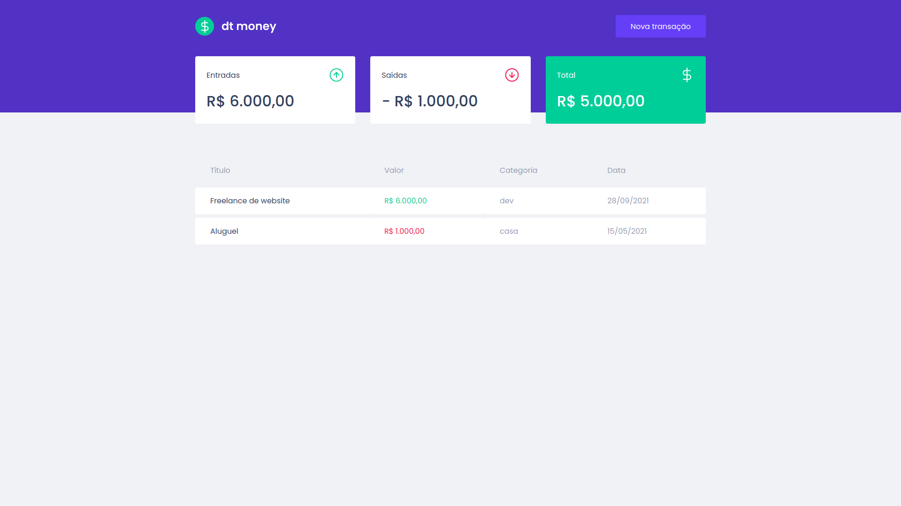
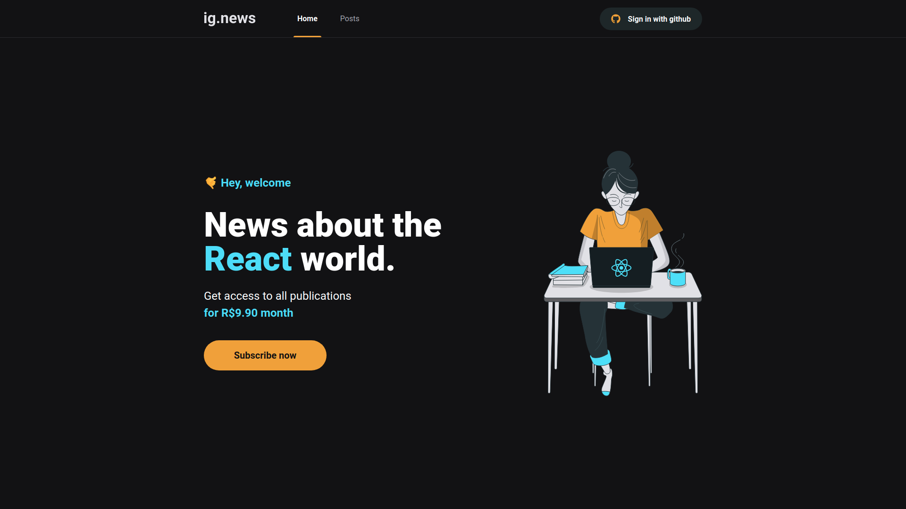
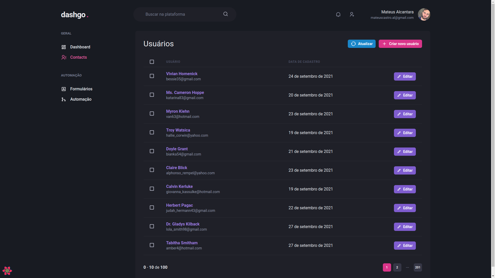

# Ignite

Repositório dedicado a organizar todos os desafios completados durante o bootcamp Ignite da Rocketseat.

# Reactjs

## Projetos das Aulas

[Github Explorer](https://github.com/mat-alcantara/github-explorer-ignite): Aplicação construída na primeira semana, com o intuito de mostrar como o React funciona por baixo dos panos.

[dtMoney](https://github.com/mat-alcantara/dtMoney): Aplicação financeira construída com Typescript, Miragejs, Styled Components, Context API e Axios.

[Ig.News](https://github.com/mat-alcantara/ig.news): Aplicação de Blog criada utilizando Nextjs, Stripe, FaunaDB, Next-auth e Prismic.

[Dashgo](https://github.com/mat-alcantara/dashgo): Aplicação de Dashboard criada utilizando Nextjs, Chakra UI e React Query.

[Next Auth](https://github.com/mat-alcantara/next-auth): Aplicação criada para mostrar os diferentes métodos de autenticação dentro do nextjs.

[Perfreact](https://github.com/mat-alcantara/perfreact): Aplicação criada para mostrar métodos de otimização das aplicações em Nextjs.

## Desafios

#### Capítulo 01

[Conceitos de React](https://github.com/mat-alcantara/ignite-reactjs-conceitos-de-react)
[Componentizando a aplicação](https://github.com/mat-alcantara/ignite-componentizando-a-aplicacao)

#### Capítulo 02

[Criando um hook de carrinho de compras](https://github.com/mat-alcantara/ignite-reactjs-criando-hook-de-carrinho)
[Refactoring de classes e TypeScript](https://github.com/mat-alcantara/ignite-reactjs-refactoring-classes-e-typescript)

#### Capítulo 03

[Criando uma aplicação do zero + Adicionado features ao blog](https://github.com/mat-alcantara/ignite-reactjs-criando-projeto-do-zero)

#### Capítulo 04

[Interface com Chakra UI](https://github.com/mat-alcantara/worldtrip)
[Upload de imagens](https://github.com/mat-alcantara/upfi)

#### Capítulos 5 e 6

Os desafios desses capítulos são baseados em desafios anteriores. No capítulo 5, precisamos otimizar a aplicação do capítulo 01 "Componentizando a aplicação". No capítulo 06, precisamos fazer deploy da aplicação principal Ig.news.

# Nodejs

## Projetos das Aulas

[finAPI](https://github.com/mat-alcantara/fin-api): Aplicação financeira desenvolvida a partir do primeiro capítulo do curso

## Desafios

#### Capítulo 01

[Conceitos do Node.js](https://github.com/mat-alcantara/conceitos-de-nodejs)
[Trabalhando com Middlewares](https://github.com/mat-alcantara/ignite-nodejs-trabalhando-com-middlewares)
[Corrigindo o código](https://github.com/mat-alcantara/ignite-nodejs-corrigindo-o-codigo)
